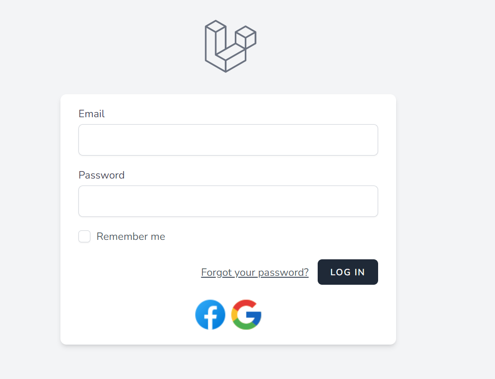

# Login with Facebook and Google using Laravel Socialite


## Installation
```
composer install
npm install
npm run dev
cp .env.example .env
php artisan key:generate
php artisan migrate
```

### ENV Configuration For Facebook & Google Provider

```
FACEBOOK_CLIENT_ID={YOURFACEBOOKID}
FACEBOOK_CLIENT_SECRET={YOURFACEBOOKSECRET}
FACEBOOK_REDIRECT={REDIRECTURL}

GOOGLE_CLIENT_ID={YOURGOOGLEID}
GOOGLE_CLIENT_SECRET={YOURGOOGLESECRET}
GOOGLE_REDIRECT={REDIRECTURL}
```


